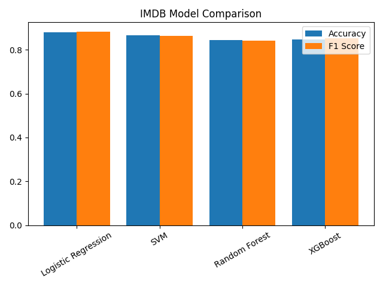
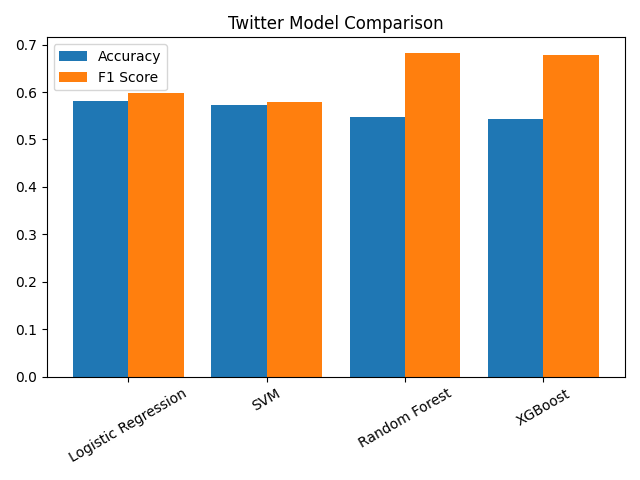
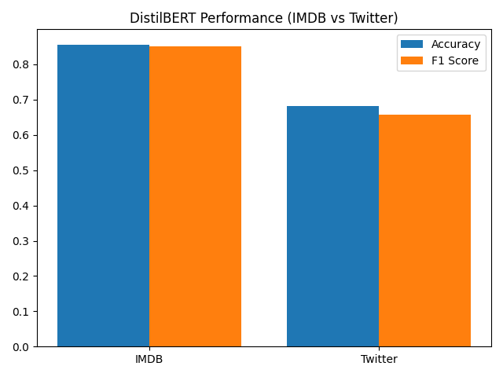

# Comparative Study of Machine Learning vs. Transformer Models for Sentiment Analysis

## 📖 Overview

This project presents a comparative analysis of traditional Machine Learning algorithms and Transformer-based deep learning models for binary sentiment classification. The models are evaluated on the **IMDB Movie Reviews** and **Twitter (Sentiment140)** datasets to analyze their performance across different text domains.

---

## 🚀 Features

* Text preprocessing using **NLTK**
* TF-IDF feature extraction
* Traditional Machine Learning models:

  * Logistic Regression
  * Support Vector Machine (SVM)
  * Random Forest
  * XGBoost
* Transformer-based model:

  * DistilBERT
* Performance evaluation using Accuracy and F1 Score
* Cross-domain evaluation on Twitter dataset
* Automatic generation of comparison graphs

---

## 🛠 Technologies Used

* Python
* Pandas
* NumPy
* Scikit-learn
* XGBoost
* Hugging Face Transformers
* PyTorch
* NLTK
* Matplotlib

---

## 📂 Datasets

### IMDB Movie Reviews

* Source: Hugging Face Datasets

### Twitter Sentiment140

* Source: Kaggle (Sentiment140)

> **Note:** The Twitter dataset is not included in this repository because it exceeds GitHub's file size limit.

Download it from:
https://www.kaggle.com/datasets/kazanova/sentiment140

After downloading, place the dataset file in the project root directory:

```text
training.1600000.processed.noemoticon.csv
```

---

## 📊 Models Compared

| Model                        | Category         |
| ---------------------------- | ---------------- |
| Logistic Regression          | Machine Learning |
| Support Vector Machine (SVM) | Machine Learning |
| Random Forest                | Machine Learning |
| XGBoost                      | Machine Learning |
| DistilBERT                   | Transformer      |

---

## 📈 Evaluation Metrics

* Accuracy
* F1 Score

---

## 📁 Project Structure

```text
.
├── main.py
├── transformer.py
├── requirements.txt
├── imdb_results.csv
├── twitter_results.csv
├── transformer_results.csv
├── imdb_comparison.png
├── twitter_comparison.png
├── transformer_comparison.png
└── README.md
```

---

## ⚙️ Installation

Clone the repository:

```bash
git clone https://github.com/yourusername/sentiment-research.git
cd sentiment-research
```

Install dependencies:

```bash
pip install -r requirements.txt
```

Run Machine Learning models:

```bash
python main.py
```

Run DistilBERT:

```bash
python transformer.py
```

---

## 📷 Results

### IMDB Model Comparison



### Twitter Model Comparison



### DistilBERT Performance



---

## 🔮 Future Improvements

* Fine-tune larger Transformer models (BERT, RoBERTa)
* Hyperparameter optimization
* Multi-class sentiment classification
* Real-time sentiment prediction
* Web-based deployment using Streamlit or Flask

---

## 👨‍💻 Author

**Tanish Solanki**

B.Tech – Computer Science & Engineering (Big Data Analytics)

Netaji Subhas University of Technology (NSUT)